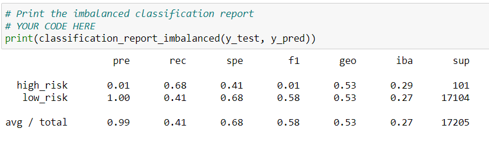

# Credit Risk Analysis

## Overview
The purpose of this analysis is to review six different machine learning models in order to help creditors make good decisions about who to approve or deny for credit. Credit risk is by nature, unbalanced, since good loans easily outnumber risky loans.

This analysis uses a credit card credit dataset from LendingClub.

## Results
Here are the results of the machine learning models which were studied.

- **RandomOverSampler (oversampling)**

  - The balanced accuracy score was .64, which is okay:

	  

  - The classification report showed a low precision score for high risk applicants, and a high precision score for low risk applicants. The recall score was pretty high for high risk applicants, and medium for low risk applicants. The F1 weighted score was low for high risk applicants and pretty high for low risk applicants.

	  

- **SMOTE (oversampling)**

  - The balanced accuracy score was .65, which is okay:

	  

  - The classification report showed a low precision score for high risk applicants, and a high precision score for low risk applicants. The recall score for high and low risk applicants was about the same. The F1 weighted score was low for high risk applicants and pretty high for low risk applicants.

	 

- **ClusterCentroids (undersampling)**
  
  - The balanced accuracy score was .54, which is not good:

	   

  - The classification report showed a low precision score for high risk applicants, and a high precision score for low risk applicants. The recall score was above half for high risk applicants, and below half for low risk applicants. The F1 weighted score was low for high risk applicants and half for low risk applicants.
  
	   

- **SMOTEENN (combination under- and oversampling)** 
  
  - The balanced accuracy score was .64, which is okay:

       
    
  - The classification report showed a low precision score for high risk applicants, and a high precision score for low risk applicants. The recall score was pretty high for high risk applicants, and medium for low risk applicants. The F1 weighted score was low for high risk applicants and pretty high for low risk applicants.
  
	   
  
- **BalancedRandomForestClassifier (ensemble)**
  
  - The balanced accuracy score was .50, which is not good:

       
    
  - The classification report showed a better precision score for high risk applicants, and a high precision score for low risk applicants. The recall score was low for high risk applicants, and high for low risk applicants. The F1 weighted score was low for high risk applicants and high for low risk applicants.

       

- **EasyEnsembleClassifier (ensemble)**

  - The balanced accuracy score was .50, which is not good:

       

  - The classification report showed a better precision score for high risk applicants, and a high precision score for low risk applicants. The recall score was low for high risk applicants, and high for low risk applicants. The F1 weighted score was low for high risk applicants and high for low risk applicants.

      

## Summary
There is always going to be a tension between precision and recall. I was interested in the results for SMOTE because the recall numbers for both the high risk and low risk applicants were closest together. The two ensemble algorithms produced identical results, so I am not sure I will pursue either of those. I would like to continue reviewing the oversampling, undersampling and combination over- and undersampling algorithms until I find one which is similar to SMOTE, but that has a higher balanced accuracy score.

