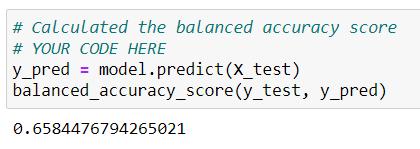
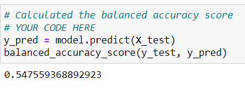

# Credit Risk Analysis

## Overview
The purpose of this analysis is to review six different machine learning models in order to help creditors make good decisions about who to approve or deny for credit. Credit risk is by nature, unbalanced, since good loans easily outnumber risky loans.

This analysis uses a credit card credit dataset from LendingClub.

## Results
Here are the results of the machine learning models which were studied.

- **RandomOverSampler (oversampling)**

  - The Balanced Accuracy Score was .64, which is okay:

	  

  - The Classification Report showed a low precision score for high risk applicants, and a high precision score for low risk applicants. The Recall score was high for high risk applicants, and medium for low risk applicants. The F1 weighted score was low for high risk applicants and high for low risk applicants.

	  

- **SMOTE (oversampling)**

  - The Balanced Accuracy Score was .64, which is okay:

	  

  - The Classification Report showed a low precision score for high risk applicants, and a high precision score for low risk applicants. The Recall score was high for high risk applicants, and medium for low risk applicants. The F1 weighted score was low for high risk applicants and high for low risk applicants.

	 

- **ClusterCentroids (undersampling)**
  
  - The Balanced Accuracy Score was .64, which is okay:

	   

  - The Classification Report showed a low precision score for high risk applicants, and a high precision score for low risk applicants. The Recall score was high for high risk applicants, and medium for low risk applicants. The F1 weighted score was low for high risk applicants and high for low risk applicants.
  
	   

- **SMOTEENN (combination under- and oversampling)** 
  
  - The Balanced Accuracy Score was .64, which is okay:

       
    
  - The Classification Report showed a low precision score for high risk applicants, and a high precision score for low risk applicants. The Recall score was high for high risk applicants, and medium for low risk applicants. The F1 weighted score was low for high risk applicants and high for low risk applicants.
  
	   
  
- **BalancedRandomForestClassifier (ensemble)**
  
  - The Balanced Accuracy Score was .50, which is not good:

       
    
  - The Classification Report showed a better precision score for high risk applicants, and a high precision score for low risk applicants. The Recall score was low for high risk applicants, and high for low risk applicants. The F1 weighted score was low for high risk applicants and high for low risk applicants.

       

- **EasyEnsembleClassifier (ensemble)**

  - The Balanced Accuracy Score was .50, which is not good:

       

  - The Classification Report showed a better precision score for high risk applicants, and a high precision score for low risk applicants. The Recall score was low for high risk applicants, and high for low risk applicants. The F1 weighted score was low for high risk applicants and high for low risk applicants.

      

## Summary
The results for undersampling, oversampling and combination over- and understampling algorithms produced identical results. The two ensemble algorithms produced identical results. I am not thrilled with any one model. I would like to continue reviewing models until I get one that has more balanced results in the classification report.

